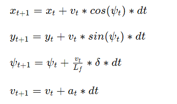

## Juexu Yang's Writeup

** Model Predictive Control Project **

The goals / steps of this project are the following:

* Choose a motion model for the vehicle that is easy to compute and close to the real trajectory
* Fit the reference points into a third order polynomial line, and view it as the groundtruth trajectory
* For every state [x, y, psi, v, cte, epsi], define a set of cost function which gives the best actuator control [delta, a].
  The actuator control should make the vehicle close to the real trajectory and behavior in a smooth way.

### Implementation

#### 1. The Model

The state of vehicle has 6 components [x, y, psi, v, cte, epsi] where:

* [x, y] is the position of the vehicle
* psi is the steering angle of the vehicle
* v is the longitudinal speed of the vehicle
* cte is the cross track error
* epsi is the error between the vehicle's heading direction and the direction of the groundtruth trajectory

The state update rules are:

#### 2. Timestep Length and Elapsed Duration (N & dt)

The Timestep **N** is set to 12, since I found it can suits different situations especially a long turn.
Smaller N will make the model unstable, while Larger N is slow to compute.
The Elapsed Duration **dt** is set to 0.11 second. 
Smaller dt will make the model unstable, while Larger dt may fail to catch up with the environment change.

#### 3. Polynomial Fitting and MPC Preprocessing

A third order polynomial line is fitted to the waypoints, since third order polynomial can apply to most road situation.

#### 4. Model Predictive Control with Latency

Everytime when I update the state with [delta, a], I subtract the latency from the elapsed duration to take the latency into account.
That is to say, for every elapsed duration the actuator control will only be effective in the last (dt - latency) seconds.